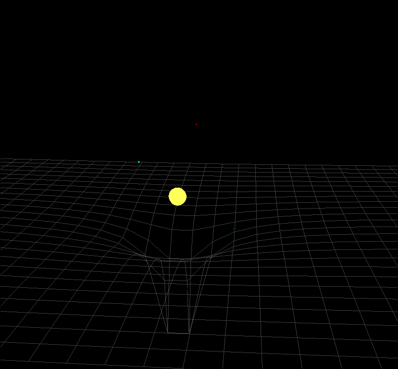

# Гравитационный Симулятор ООП

3D-симулятор гравитации N-тел, созданный с использованием C++, OpenGL, GLM, GLEW и GLFW. Этот проект визуализирует гравитационные взаимодействия между небесными телами и включает динамическую сетку, которая деформируется, представляя искривление пространства-времени под действием массы.


*(Замените screenshot.png на реальное изображение вашей симуляции)*

## Содержание

1.  [Особенности](#особенности)
2.  [Физическая модель](#физическая-модель)
    *   [Взаимодействие небесных тел](#взаимодействие-небесных-тел)
    *   [Деформация сетки пространства-времени](#деформация-сетки-пространства-времени)
3.  [Используемые технологии](#используемые-технологии)
4.  [Начало работы](#начало-работы)
    *   [Необходимые компоненты](#необходимые-компоненты)
    *   [Сборка](#сборка)
    *   [Запуск](#запуск)
5.  [Управление](#управление)
6.  [Структура кода](#структура-кода)
7.  [Возможные улучшения](#возможные-улучшения)

## Особенности

*   **Симуляция N-тел:** Моделирует гравитационные силы между несколькими небесными телами.
*   **Динамическое создание объектов:** Интерактивное создание новых небесных тел в симуляции.
    *   Нажмите и удерживайте Левую Кнопку Мыши (ЛКМ), чтобы разместить объект.
    *   Перемещайте мышь, удерживая ЛКМ, для позиционирования объекта.
    *   Используйте Клавиши со Стрелками (и Shift + Клавиши со Стрелками для вертикального перемещения) для точной настройки положения во время создания.
    *   Удерживайте Правую Кнопку Мыши (ПКМ) во время создания, чтобы увеличить массу нового объекта.
    *   Отпустите ЛКМ, чтобы запустить объект.
*   **Визуальное искривление пространства-времени:** 2D-сетка деформируется в третьем измерении в зависимости от массы и близости небесных тел, обеспечивая визуальную аналогию кривизны пространства-времени в Общей Теории Относительности.
*   **Система 3D-камеры:**
    *   Камера для "полета" с управлением клавишами WASD.
    *   Пробел/Левый Shift для вертикального перемещения.
    *   Обзор мышью для ориентации.
    *   Колесо прокрутки мыши для движения вперед/назад (эффект масштабирования путем перемещения камеры).
*   **Базовый рендеринг сфер:** Небесные тела отображаются в виде сфер с простым освещением.
*   **Пауза/Возобновление:** Симуляцию можно приостановить и возобновить.
*   **Эффект свечения:** Объекты, обозначенные как "звезды" (например, центральный массивный объект), могут иметь эффект свечения.

## Физическая модель

### Взаимодействие небесных тел

Симуляция моделирует гравитационное притяжение между небесными телами, используя **Закон всемирного тяготения Ньютона**:

*   Сила (F) между двумя массами (m₁ и m₂) прямо пропорциональна произведению их масс и обратно пропорциональна квадрату расстояния (r) между их центрами.
*   Формула: `F = G * (m₁ * m₂) / r²`
    *   `G` — гравитационная постоянная (прибл. `6.6743e-11 Н(м/кг)²`).
*   Для каждой пары объектов рассчитывается гравитационная сила.
*   Эта сила затем используется для определения ускорения (`a = F/m`) каждого объекта.
*   Скорость и положение каждого объекта обновляются пошагово с малым временным шагом (Δt) с использованием базового метода интегрирования Эйлера:
    *   `новая_скорость = старая_скорость + ускорение * Δt`
    *   `новое_положение = старое_положение + новая_скорость * Δt`
*   Обнаружение столкновений является элементарным: если радиусы двух объектов пересекаются, их скорости замедляются.

### Деформация сетки пространства-времени

Деформация сетки — это **визуальная аналогия** того, как масса искривляет пространство-время, как описано в Общей Теории Относительности Эйнштейна. Это **не** полноценная симуляция ОТО.

*   Изначально сетка представляет собой плоскую плоскость из соединенных линий.
*   Каждая вершина сетки смещается вертикально (вдоль оси Y) в зависимости от ее близости к массивным объектам.
*   На расчет смещения для каждой вершины влияют:
    1.  **Масса объекта (`obj.mass`)**: Более массивные объекты вызывают большую деформацию.
    2.  **Расстояние от объекта до вершины сетки (в плоскости XZ, `distanceXZ_m`)**: Деформация уменьшается с расстоянием.
    3.  **Радиус Шварцшильда (`rs`)**: Рассчитывается как `rs = (2 * G * obj.mass) / c²`, где `c` — скорость света. Это характерный радиус, связанный с любой массой. Если масса M сжата до своего радиуса Шварцшильда, она образует черную дыру. В этой симуляции он используется как фактор силы деформации.
    4.  `warpFactor` (коэффициент искривления) масштабирует эффект.
*   Вертикальное смещение (`totalDisplacementY`) для вершины сетки представляет собой сумму вкладов от всех массивных объектов:
    `totalDisplacementY -= warpFactor * (rs / distanceXZ_m)` (упрощенно).
*   Сетка также смещается вертикально в зависимости от центра масс объектов, чтобы оставаться несколько центрированной.

Это создает "гравитационные колодцы" в сетке вокруг массивных объектов, обеспечивая визуальное представление их гравитационного влияния.

## Используемые технологии

*   **C++17:** Основной язык программирования.
*   **OpenGL (3.3+):** Для рендеринга 2D/3D графики.
*   **GLEW (OpenGL Extension Wrangler Library):** Для управления расширениями OpenGL.
*   **GLFW (Graphics Library Framework):** Для создания окна, обработки ввода и управления контекстом OpenGL.
*   **GLM (OpenGL Mathematics):** Для векторных и матричных операций (например, `glm::vec3`, `glm::mat4`).
*   **GLSL (OpenGL Shading Language):** Для написания вершинных и фрагментных шейдеров.

## Начало работы

### Необходимые компоненты

*   Компилятор C++, поддерживающий C++17 (например, GCC, Clang, MSVC).
*   CMake (рекомендуется версия 3.10 или выше).
*   **GLEW:** Библиотеки для разработки.
*   **GLFW:** Библиотеки для разработки.
*   **GLM:** Заголовочная библиотека, часто включается в состав или легко загружается.

**Установка (Пример для Ubuntu/Debian):**
```bash
sudo apt update
sudo apt install build-essential cmake libglew-dev libglfw3-dev libglm-dev